# 💥 Ember Quest Game

A 2D platformer game inspired by Super Mario Bros, built with [Flame Engine](https://flame-engine.org/) and Flutter.  
Jump, dodge, and collect magical stars as you guide Ember through vibrant pixel worlds filled with mystery and danger!

---

## 🎮 Gameplay

- 🌟 Collect stars
- 🧱 Platformer-style movement and jumping
- 👾 Enemies and obstacles to avoid
- 💥 Power-ups and effects (optional)
- 🎨 Retro pixel art style with smooth animation

---

## 🧩 Powered By

- 🔥 [Flame Engine](https://flame-engine.org/)
- 🐦 Flutter
- 🧪 Dart

---

## 📦 Platforms Supported

- 🕹️ Web (HTML5)
- 💻 Windows
- 📱 Android

---

## 📷 Screenshots

> Screenshots from each platform

### 🖥️ Windows

| Main Menu                                             | Gameplay                                                      | Game Over                                                      |
|-------------------------------------------------------|---------------------------------------------------------------|----------------------------------------------------------------|
| 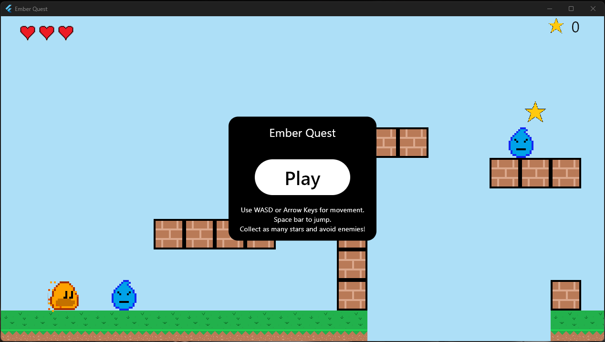 | 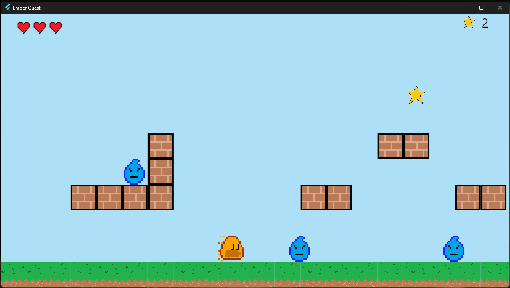 | 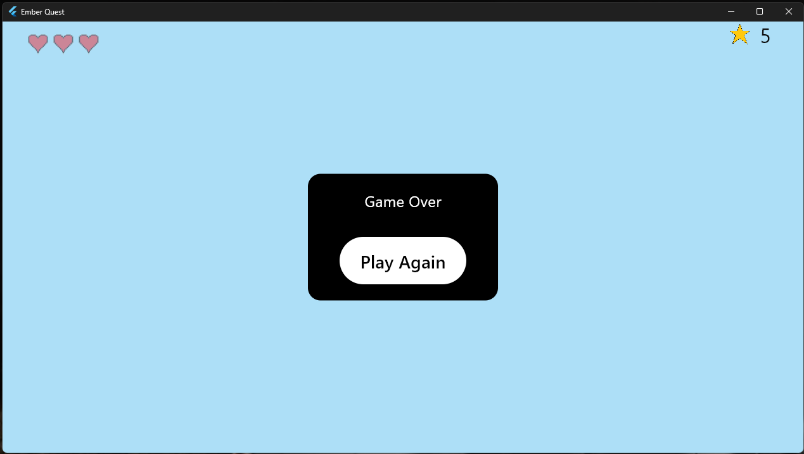 |

---

### 🌐 Web

| Main Menu                                 | Gameplay                                          | Game Over                                          |
|-------------------------------------------|---------------------------------------------------|----------------------------------------------------|
| 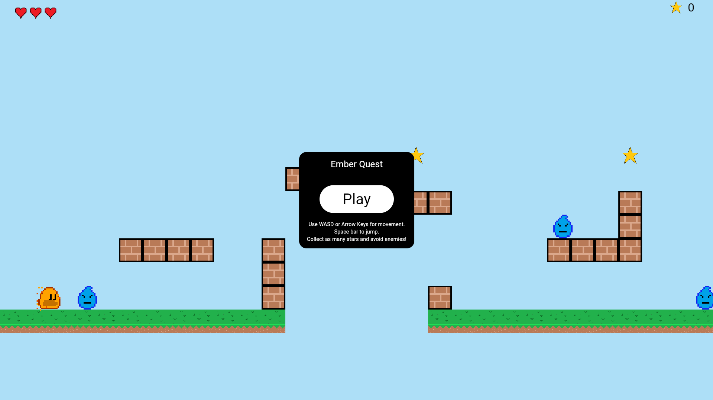 | 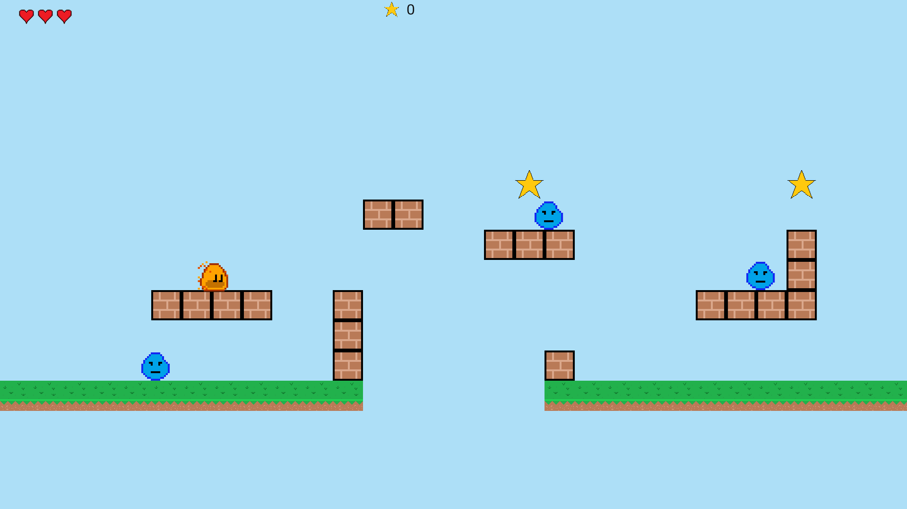 | 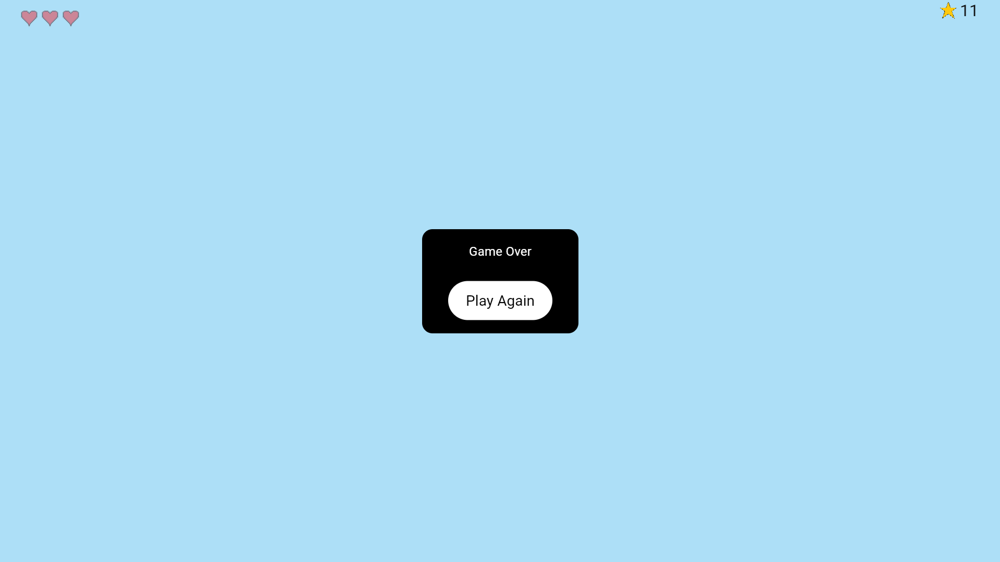 |

---

### 📱 Android

| Main Menu                                                       | Gameplay                                                                | Game Over                                                                |
|-----------------------------------------------------------------|-------------------------------------------------------------------------|--------------------------------------------------------------------------|
| 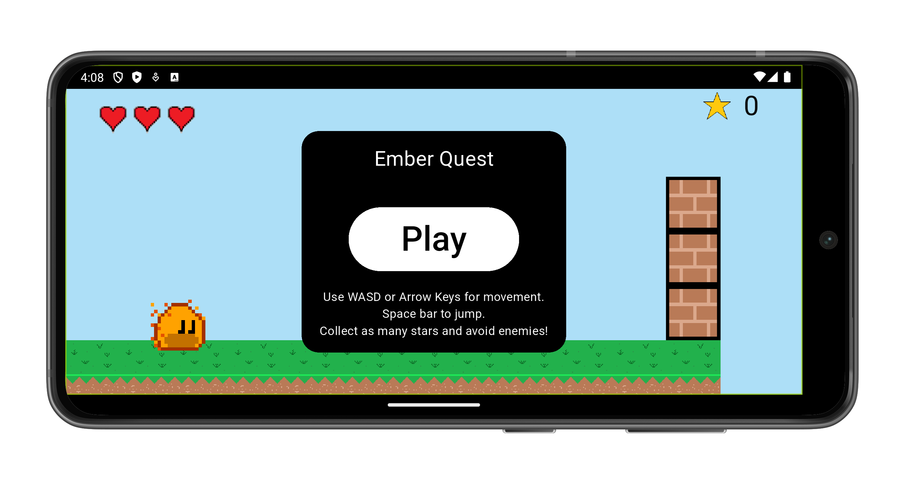 | 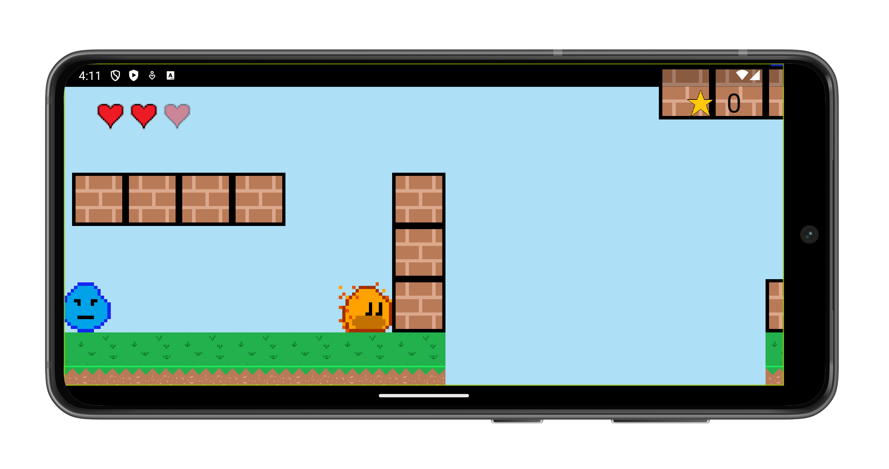 | 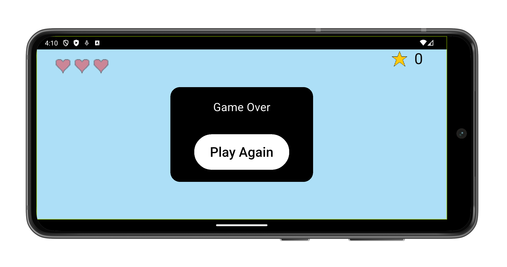 |
| 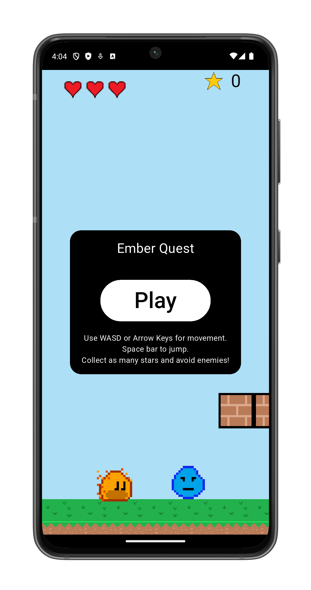  | 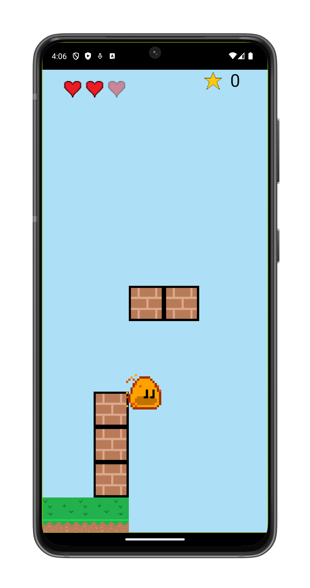  | 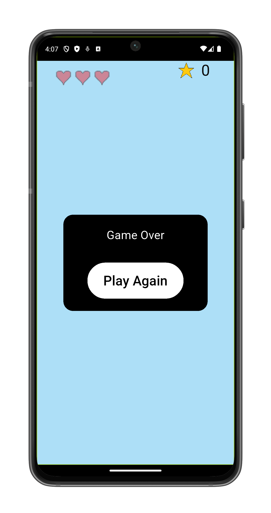  |

---

## 🌐 Live Demo

- 🔗 **Web (GitHub Pages):**  
  [Play Now](https://omnitechphilippines.github.io/ember-quest/)

---

## 📦 Download Releases

- 💻 **Windows (.7z):**  
  [Download for Windows {{VERSION}}](https://github.com/omnitechphilippines/ember-quest/releases/download/v1.0.0%2B1/windows-release-{{ENCODED_VERSION}}.7z)

- 📱 **Android (.apk):**  
  [Download for Android {{VERSION}}](https://github.com/omnitechphilippines/ember-quest/releases/download/v1.0.0%2B1/app-release-{{ENCODED_VERSION}}.apk)

- 🌐 **Web build (.7z):**  
  [Download Web Build {{VERSION}}](https://github.com/omnitechphilippines/ember-quest/releases/download/v1.0.0%2B1/web-release-{{ENCODED_VERSION}}.7z)

> You can also find all versions in the [Releases Page](https://github.com/omnitechphilippines/ember-quest/releases)

---

## 🚀 Getting Started

### Prerequisites

- Flutter SDK `v3.29.0`
- Dart SDK `v3.7.0`

### Run the game

```bash
# Clone the repo
git clone https://github.com/omnitechphilippines/ember-quest.git
cd ember-quest

# Get packages
flutter pub get

# Run the game (Web)
flutter run -d chrome

# Run the game (Windows)
flutter config --enable-windows-desktop
flutter run -d windows

# Run the game (Android)
flutter run -d android
